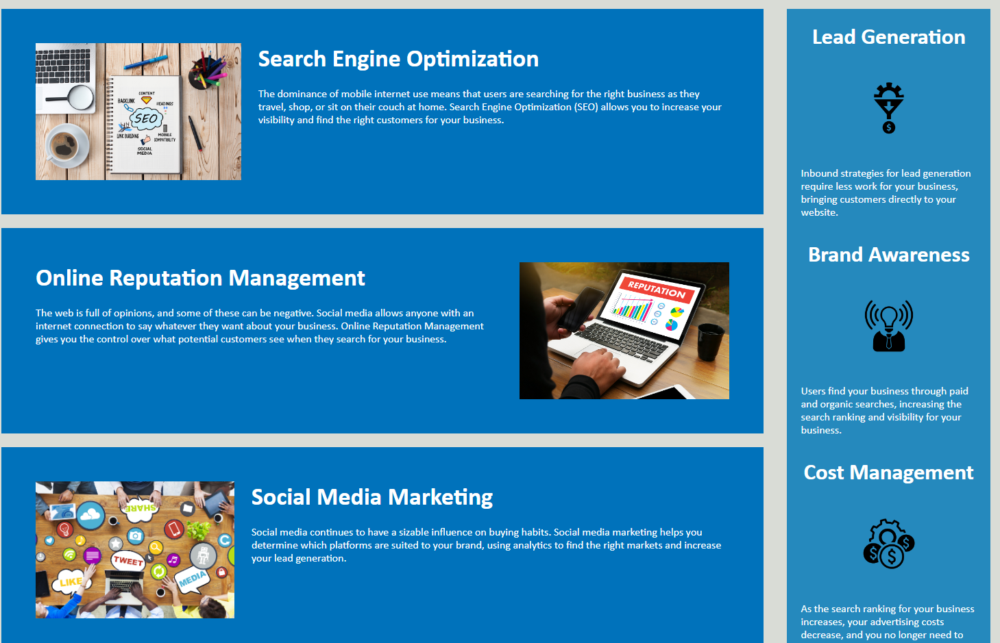

# Challenge-1

This is the first challenge of my UW Coding bootcamp Curriculum.

For this challenge, we had to meet the acceptance criteria for making a webpage more optimized by following basic accessibility standards

In this code you will find Semantic HTML elements, descriptive alt attributes, as well as HTML that is in organized sequential structure. 

This challenge was done using a starter template

View the web-page here

https://noahbrown26.github.io/Challenge-1/

